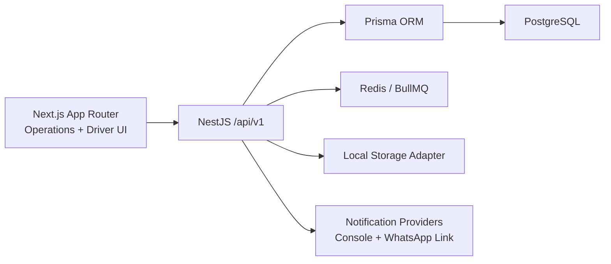

# Architecture

## Overview

The MVP is a pnpm/Turborepo monorepo with a NestJS API, PostgreSQL database, Prisma ORM, Redis/BullMQ queue hooks and a Next.js operations portal.

## Modules

- Authentication: JWT access and refresh tokens, password hashing and refresh revocation.
- RBAC: roles enforced by Nest guards and decorators.
- Booking workflow: future scheduling, controlled transitions, history and audit events.
- Assignment: manual assignment, reassignment, driver workload and overlap warnings.
- Driver mobile: scoped assigned jobs and step-by-step status actions.
- Inspection: vehicle condition checklist, acknowledgement and local images.
- Workshop handover: acceptance or discrepancy; completion only after acceptance.
- Dashboard/reports: live aggregates from PostgreSQL, CSV export for report endpoints.

## Important Design Decisions

- Dispatcher and driver interfaces live in the same responsive Next.js app for MVP.
- Local storage is hidden behind a storage service so S3-compatible object storage can replace it later.
- Notification providers are interface-based: console provider, WhatsApp link generator and future WhatsApp Business adapter placeholder.
- Route optimization is represented by an extension service boundary, but is not implemented in MVP.
